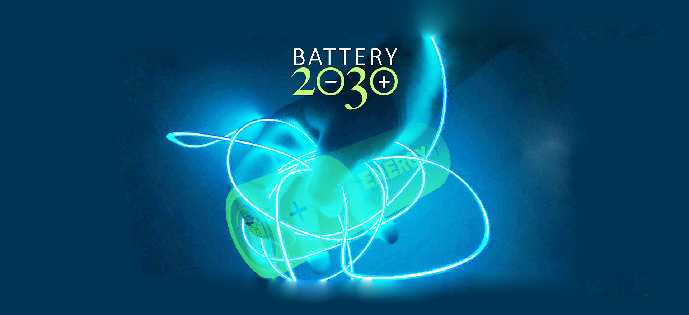

.. AiiDA Yambo documentation
   
###########################################
`AiiDA`_ plugin and workflows for `YAMBO`_
###########################################

.. figure:: images/AiiDA_transparent_logo.png
    :width: 300px
    :align: left
    :height: 72px

.. _AiiDA: http://www.aiida.net
.. _YAMBO: http://www.yambo-code.org/

Welcome to documentation of the aiida-yambo package!
==============================================================================

The package is available at http://github.com/yambo-code/aiida-yambo/

If you use this package for your research, please cite the following works:

* M. Bonacci, J. Qiao , N. Spallanzani, A. Marrazzo, G. Pizzi, E. Molinari, D. Varsano, A. Ferretti, D. Prezzi,
  *Towards high-throughput many-body perturbation theory: efficient algorithms and automated workflows*, `arXiv:2301.06407`_.

.. _arXiv:2301.06407: https://doi.org/10.48550/arXiv.2301.06407

* D. Sangalli, A. Ferretti, H. Miranda, C. Attaccalite, I. Marri, E. Cannuccia, P. Melo, M. Marsili, F. Paleari, A. Marrazzo, G. Prandini,
  P. Bonfà, M.O. Atambo, F. Affinito, M. Palummo, A. Molina-Sánchez,
  C. Hogan, M. Grüning, D. Varsano, A. Marini, *Many-body perturbation theory calculations using the yambo code*,
  J. Phys. Condens. Matter, 31, 325902 (2019); https://doi.org/10.1088/1361-648X/ab15d0; http://www.yambo-code.org.

* G. Pizzi, A. Cepellotti, R. Sabatini, N. Marzari,
  and B. Kozinsky, *AiiDA: automated interactive infrastructure and database
  for computational science*, Comp. Mat. Sci 111, 218-230 (2016);
  http://dx.doi.org/10.1016/j.commatsci.2015.09.013; http://www.aiida.net. 

User's guide
++++++++++++

.. toctree::
   :maxdepth: 4

   user_guide/index

Modules provided with aiida-yambo (API reference)
+++++++++++++++++++++++++++++++++++++++++++++++++

.. toctree::
   :maxdepth: 4

   module_guide/index

Indices and tables
==================

* :ref:`genindex`
* :ref:`modindex`
* :ref:`search`

Acknoledgements
===============

This work was supported by: the Centre of Excellence "MaX - Materials Design at the Exascale" funded by European Union 
(H2020-EINFRA-2015-1, Grant No. 676598; H2020-INFRAEDI-2018-1, Grant No. 824143; HORIZON-EUROHPC-JU-2021-COE-1 , 
Grant No. 101093324); the European Union's Horizon 2020 research and innovation programme 
(BIG-MAP, Grant No. 957189, also part of the BATTERY 2030+ initiative, Grant No. 957213); 
NCCR MARVEL, a National Centre of Competence in Research, funded by the Swiss National Science 
Foundation (Grant No. 205602).

.. figure:: images/cropped-cropped-logo-MAX-orizz-300.png
    :width: 350px
    :align: left
    :height: 110px

.. figure:: images/bigmap_logo.png
    :width: 250px
    :align: left
    :height: 250px

.. figure:: images/s3center.png
    :width: 250px
    :align: right
    :height: 250px

.. figure:: images/MARVEL.png
    :width: 250px
    :align: right
    :height: 250px