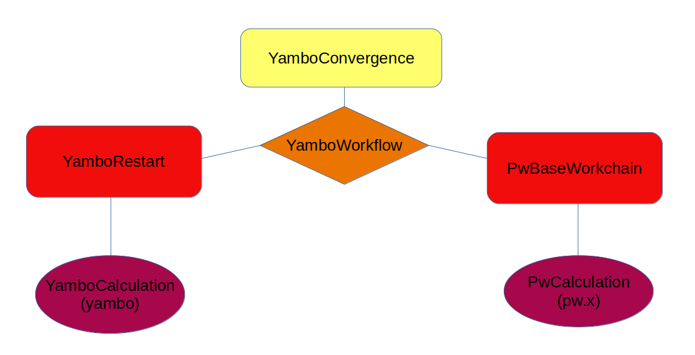

.. _sec.yambo_workflows:

WorkChains for AiiDA-Yambo
--------------------------

Description
^^^^^^^^^^^
This plugin provides several workflows for performing automated MBPT with `Yambo`.
The following shows how to use the workflows provided by the  `aiida yambo` plugin.
The hierarchy of the workflows can be represented from the following picture: 

Simple YamboRestart workchain
^^^^^^^^^^^^^^^^^^^^^^^^^^^^^
.. toctree::
   :maxdepth: 4

   yamborestart

Complete YamboWorkflows
^^^^^^^^^^^^^^^^^^^^^^^
.. toctree::
   :maxdepth: 4

   yamboworkflow

YamboConvergence: automated convergence 
^^^^^^^^^^^^^^^^^^^^^^^^^^^^^^^^^^^^^^^
.. toctree::
   :maxdepth: 4

   yamboconvergence

Protocols: automated inputs creation 
^^^^^^^^^^^^^^^^^^^^^^^^^^^^^^^^^^^^
.. toctree::
   :maxdepth: 4

   protocols
   