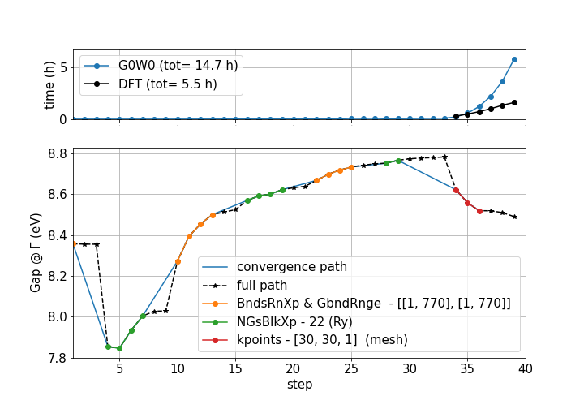
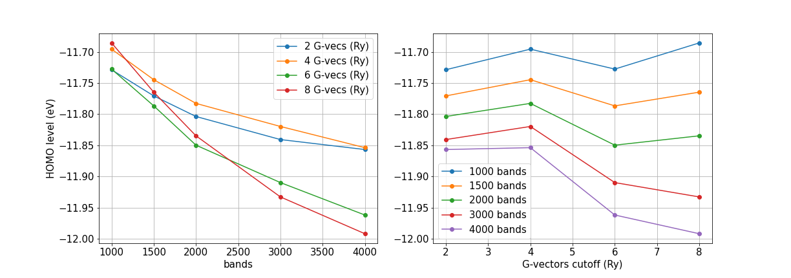
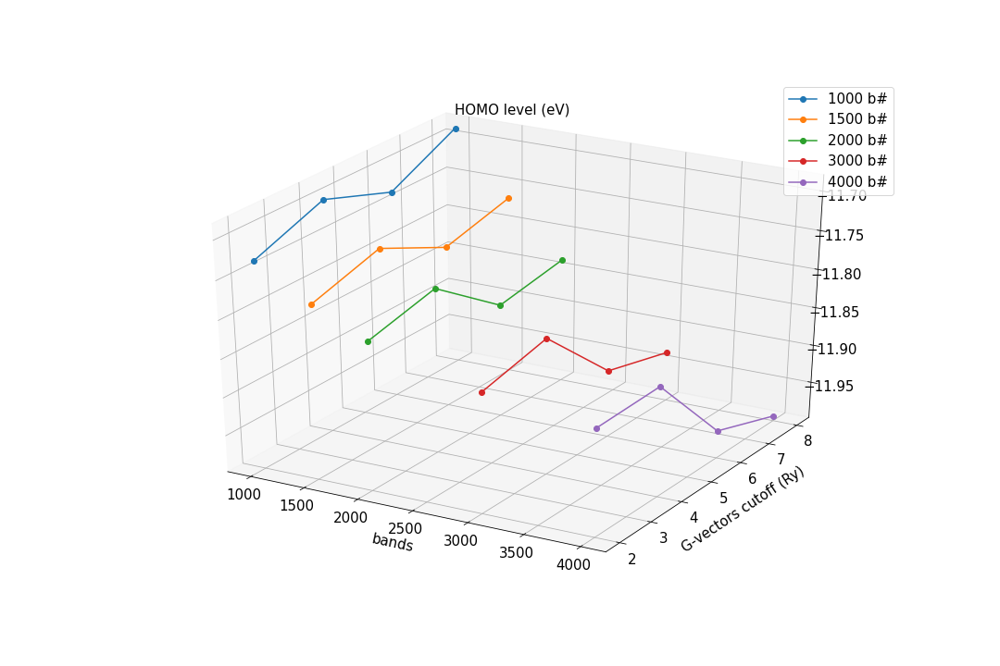

.. _tut-ref-to-yambo-conv_pp:

Plot results of YamboConvergence - '1D_convergence'
---------------------------------------------------

The plugin provides some function to helps you in plotting the outcome of a YamboConvergence workchain.
In the case of '1D_convergence' you can use:

::

    from matplotlib import pyplot as plt
    from aiida_yambo.workflows.utils.plotting import *
    
    fig, ax = plt.subplots(figsize=(10,7),)
    ax.grid()
    ax.tick_params(axis='both', labelsize=15)
    ax.set_xlim(1,40)
    ax.set_xlabel('step',fontsize=15)
    ax.set_ylabel('Gap @ $\Gamma$ (eV)',fontsize=15)
    ax.legend(fontsize=15)
    
    plot_1D_convergence(ax,story=YamboConvergence_node) #story can be also just pk, output list or dataframe_from_out_list--> you can combine worchain stories

then, if you are studying monolayer hBN, you may obtain something like this: 

.. image:: ./images/2D_hBN.png

you may want also to take trace of timing of each step: 

:: 

    from matplotlib import pyplot as plt
    from aiida_yambo.workflows.utils.plotting import *
    from aiida_yambo.workflows.utils.collectors import *

    df_t = get_timings(story=YamboConvergence_node) #story can be also just pk, output list or dataframe_from_out_list--> you can combine worchain stories

    fig, ax = plt.subplots(2,1,figsize=(10,7),gridspec_kw={
                            'height_ratios': [1,3],})
    ax[1].grid()
    ax[1].tick_params(axis='both', labelsize=15)
    ax[1].set_xlim(1,40)
    ax[1].set_xlabel('step',fontsize=15)
    ax[1].set_ylabel('Gap @ $\Gamma$ (eV)',fontsize=15)
    plot_1D_convergence(ax[1],story=YamboConvergence_node) #story can be also just pk, output list or dataframe_from_out_list--> you can combine worchain stories
    ax[1].legend(fontsize=15)
    ax[0].grid()
    ax[0].plot(df_t.step,df_t.time_gw/3600, 'o-',label='G0W0 (tot= {} h)'.format(round(df_t.time_gw.sum()/3600,1)))
    ax[0].plot(df_t.step[df_t.time_pw> 0],df_t.time_pw[df_t.time_pw> 0]/3600, 'o-',\
            label='DFT (tot= {} h)'.format(round(df_t.time_pw.sum()/3600,1)),color='black')
    ax[0].set_ylabel('time (h)',fontsize=15)
    ax[0].tick_params(axis='y', labelsize=15)
    ax[0].tick_params(axis='x', labelsize=0)
    ax[0].set_xlim(1,40)
    ax[0].set_ylim(0,max(df_t.time_gw/3600)+1)
    ax[0].legend(fontsize=15)

outcome:

as expected, the most time consuming part is the final one: the k-points convergence. In the legend you can see the value of the parameters needed to obtain 
the desired convergence. The only parameters displayed are the one who changes from the initial state. You can check it by hands exploring the inputs parameters 
and k-point mesh of the last convergenced calculation of the YamboConvergence run.

Plot results of YamboConvergence - fixed-path('2D_space')
---------------------------------------------------------

If you are exploring a 2D space for convergences, you can use the ``plot_2D_convergence`` function provided in the workflows.plotting module. In this case, 
you have to provide the three array that represent the result (z axis) and the two that represent the values of the parameter at each step. 
This may see cumbersome to obtain from the output list of the YamboConvergence, but you can use some collector function provided from the workflows.collectors 
module. Let's see an example of the study on a SiH4 molecule:

::

    from aiida_yambo.workflows.utils.collectors import *
    from aiida_yambo.workflows.utils.plotting import *

    res_array, res_dataframe = collect_results(story=YamboConvergence_node) #...
    p = pd.DataFrame(res_array,columns=['bandsSE','bandsX','Ry','HOMO_energy(eV)']) #you need to know the parameters and what you observe as output

to prepare the plotting data; then you can plot results in 2D: 
    
::

    fig, ax = plt.subplots(1,2,figsize=(17,6))
    ax[0].grid()
    ax[0].tick_params(axis='both', labelsize=15)
    #fig.gca(projection='3d')
    ax[0].set_xlabel('bands',fontsize=15)
    ax[0].set_ylabel('HOMO level (eV)',fontsize=15)
    plot_2D_convergence(ax[0],p.Ry.to_numpy(),p.bandsX.to_numpy(),p.IP.to_numpy(), plot_type='2D',
                    parameters = {'y':'bands','x':'G-vecs (Ry)'})
    ax[0].legend(fontsize=15)
    #plt.savefig('hBN')
    ax[1].grid()
    ax[1].tick_params(axis='both', labelsize=15)
    #fig.gca(projection='3d')
    ax[1].set_xlabel('G-vectors cutoff (Ry)',fontsize=15)
    #ax[1].set_ylabel('HOMO level (eV)',fontsize=15)
    plot_2D_convergence(ax[1],p.bandsX.to_numpy(),p.Ry.to_numpy(),p.IP.to_numpy(), plot_type='2D',
                    parameters = {'x':'bands','y':'G-vecs (Ry)'})
    ax[1].legend(fontsize=15)

    #plt.savefig('SiH4_2d')

obtaining:

or in 3D:

::

    fig = plt.figure(figsize=(15,10))
    fig.gca(projection='3d')
    plt.grid()
    plt.tick_params(axis='both', labelsize=15)
    plt.ylabel('G-vectors cutoff (Ry)',fontsize=15,labelpad=10)
    plt.xlabel('bands',fontsize=15,labelpad=10)
    plt.title('HOMO level (eV)',fontsize=15)
    plot_2D_convergence(plt,p.bandsX.to_numpy(),p.Ry.to_numpy(),p.IP.to_numpy(), plot_type='3D',
                    parameters = {'x':'b#','y':'G-vecs (Ry)'})
    plt.legend(fontsize=15)
    #plt.savefig('SiH4_3d')

where you obtain:

