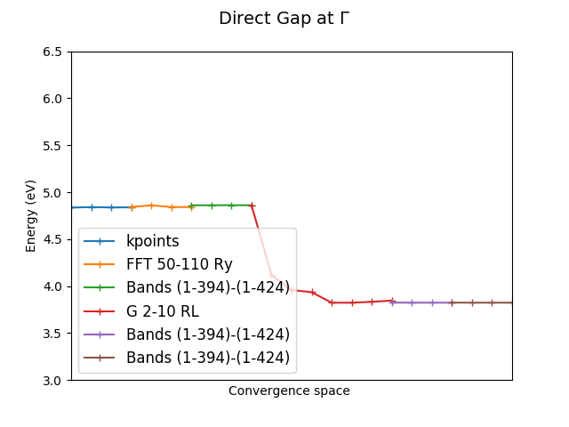

.. _tut-ref-to-yambo-tutorial:

Yambo Workflows Tutorial
========================

.. toctree::
   :maxdepth: 2

The following shows how to use the workflows provided by the  `aiida yambo` plugin.

YamboRestartWf 
--------------

The `YamboRestartWf` provides the ability to run yambo GW calculations, starting from completed 
NSCF PW calculations.  It can restart the calculations should they fail from several types of
causes including: 

  1.) Queue time exhaustion
  2.) Memory related failures (the workflow will adjust the parallelism before resubmitting, by reducing MPI in favour of threading)

Example usage:

.. include:: ../../../../examples/test_wf/test_yambo.py
   :literal:

YamboWorkflow
--------------

The `YamboWorkflow`  provides the functionality to run GW calculation from the PW step, passing in all the  required 
parameters for both the  KS DFT step with PW and the subsequent GW step. It uses the PW workflow from `aiida-quantumespresso` 
as a subworkflow to perform the first  DFT part and the `YamboRestartWf`  for the GW part.

Example usage.

.. include:: ../../../../examples/test_wf/test_scf2yambo.py
   :literal:

YamboConvergenceWorkflow
------------------------

The `YamboConvergenceWorkflow` provides the functionality to run 1-D GW convergence computations for 1 selected parameter. 
It supports converging the follwing dimensions: k-points, FFT,  Bands (GbndRnge,BndsRnXp) and W cutoff (NGsBlkXp). 

Example usage:

.. include:: ../../../../examples/test_wf/test_convergence.py
   :literal:

YamboFullConvergenceWorkflow
----------------------------                                                                                                                                                     
                                                                                                                                                                                    
The `YamboFullConvergenceWorkflow` provides the functionality to run 4-D line search  GW convergence computations.
These parameters are automtically converged   k-points, FFT,  Bands (GbndRnge,BndsRnXp) and W cutoff (NGsBlkXp). 
The algorithm converges the k-points, and uses those converged kpts to converge the FFT grid, and then those converged
kpts+FFT to converge the Bands, and from there uses the converged kpts+FFT+Bands to converge the W cutoff. The converged
W cutoff used to redo the Bands step, and should it converged at a different value, the W cutoff is repeated too, otherwise
the calculation is considered fully converged. This last two steps will be repeated as neccessary until there is a consistence
convergence between the bands and W-cutoff.
                                                                                                                                                                                 
Example usage: 

.. include:: ../../../../examples/plugin/workflow/TiO2/Full/tio2_wf_full_example.py
   :literal:

The complete workflow will return the  results of the convergence iterations, as well as a final converged set of parameters.
The data can be plotted to produce the following:

