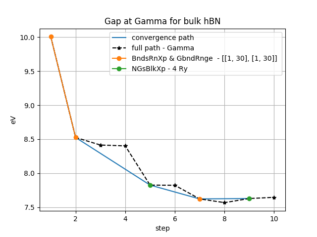

.. _tut-ref-to-yambo-conv1d:

YamboConvergence: automated convergence
---------------------------------------

The ``YamboConvergence`` workchain provides the functionalities to run multiple G0W0 calculations on the same system, over a wide range of chaging parameter. 
This represents the typical method to obtain an accurate evaluation of the quasiparticle correction: indeed, a lot of effort has to be done in order to find
the convergence with respect to parameters like empty states used to evaluate the Self Energy used to solve the quasiparticle equation.
If you implement a logic for convergence evaluation to guide the iter of these multiple parameter-dependent calculations, you can obtain an automatic flow
that allows you to obtain good G0W0 results. This is what YamboConvergence does, in its '1D_convergence' mode. The philosophy behind is the iteration over a single
parameter at the time, choosing the cheapest converged result as starting point eahc time you change the interested parameter. A lot of effort was put in order to have a more flexible procedure to run multiple calculations, focusing on a very generic convergence 
scheme: setup, run a group of calculations, check the results, stop or do other calculations. Repeat. This allowed us to define different logic to perform 
convergence analysis by simply enriching the python functions and classes imported by the workflow. For example, in the future it will be possible to evaluate 
convergence also by performing fittings over the parameters, defining by hand (case-sensitive) the fitting function. For now, we just evaluate the convergence 
by evaluating the difference between the last calculation done and the previous ones, with respect to a given threshold (like tens of meV). This threshold has 
to be provided in the workflow_settings, as you can see from the example.

Let's see the case of automatic search of convergence over an arbitrary number of parameters, activated by setting ``"type": 1D_convergence``:

Example usage:

.. include:: ../../../../examples/test_wf/yambo_convergence.py
   :literal:

As you can see, we have to provide workflow_settings, which encode some workflow logic:

::

    {'type':'1D_convergence','what':'gap','where':[(k_v,vbM,k_c,cbm)],'where_in_words':['Gamma']})

The workflow submitted here looks for convergence on different parameters, searching each step a given parameter(1D). The iter is specified
with the input list ``parameters_space``. This is a list of dictionaries, each one representing a given phase of the investigation. The quantity that tries
to converge is the gap('what') between given bands evaluated at fixed k-points. It is possible to choose also and indirect gap(notice that,
changing the k-point mesh, the k-points will change index: for now we have not a logic to trace the index-change). The other functionality of the converge workflow is to converge single levels
('gap'->'single-levels', [(k_v,vbM,k_c,cbm)]->[(k,b)]), useful in the study of molecules. It is possible also to search convergence simultaneously for
multiple gaps/levels, just adding tuples in the 'where' list. The workflow will take care of it and doesn't stop until all the quantities are
converged(or the maximum restarts are reached).

The complete workflow will return the results of the convergence iterations, as well as a final converged calculation, from which we can parse the
converged parameters, and a complete story of all the calculations of the workflow with all the information provided.

The data can be plotted using a function in :

::

    from aiida_yambo.utils.plot_utilities import plot_conv
    plot_conv(<workflow_pk>,title='Gap at Gamma for bulk hBN')

As you can see, the actual path of investigation is provided from inputs, but usually is always the same: bands and G-vectors cutoff (plus a final k-points
convergence not seen here). The black stars represent overconverged results for each parameter-iteration. 
To see more examples, go to :ref:`conv_pp_1d`. There, we can see real convergence on 2D-hBN. 

Outputs of a YamboConvergence calculation are two: a Dict with the collection of information on all the calculations, and a Dict with the description of
the last converged calculations, from which you can easily collect the converged parameters. To give a human-readable meaning to the output Dict, you can, after converted
in dict (Dict is and AiiDA Data), build a pandas dataframe:

::
    
    import pandas as pd
    dataframe = pd.DataFrame(outdict)